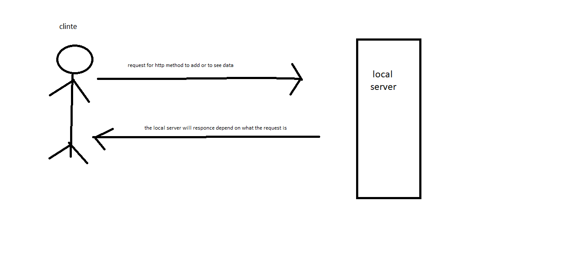

# api-server

## Class-06

### API-SERVER

#### Links 

[PR](https://github.com/YazanAlaiwah-401-advanced-javascript/api-server/pull/1)
 
[Swagger ](https://app.swaggerhub.com/apis/YazanAlaiwah/json-server/0.1)

<!-- #### Modules
*`input.js`*
*`notes.js`* -->

#### Setup

you need to install json-server in global and use it with postman or httpi or swagger use the localhost path
*GET* -> `/categories` will reuturn list of all data in categoies tabel
*GET* -> `/categories?[field]=[search value]` will reuturn list of all data in categoies tabel that have the field equal to the value you pass
*GET* -> `/categories/<id>` will return the category that have the id you pass
*POST* -> `/categories` with the data need it in the body
*PUT* -> `/categories<id>` will updata all fields in the category tabel that have the id you pass
*PATCH* -> `/categories<id>` will updata part of the id you pass in category tabel

*GET* -> `/products` will reuturn list of all data in products tabel
*GET* -> `/products?[field]=[search value]` will reuturn list of all data in products tabel that have the field equal to the value you pass
*GET* -> `/products/<id>` will return the products that have the id you pass
*POST* -> `/products` with the data need it in the body
*PUT* -> `/products<id>` will updata all fields in the products tabel that have the id you pass
*PATCH* -> `/products<id>` will updata part of the id you pass in products tabel

<!-- #### Tests -->

<!-- Lint test: npm run lint -->
<!-- unit test: npm test -->

#### UML

